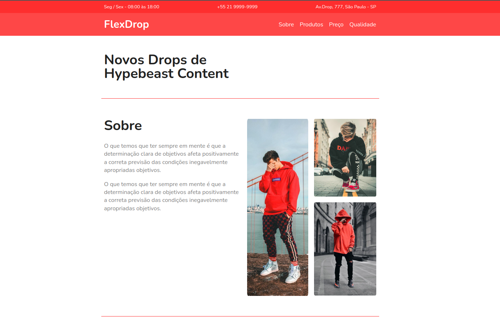

  

## 💻 Projeto
Esse é um projeto responsivo de um site para uma loja de drops Hypebeast feito apenas com CSS Flexbox.

## 🚀 Tecnologias
Esse projeto foi desenvolvido para práticar o Flexbox.
Certificado do curso da origamid onde aprendi Flexbox através [Desse link](origamid.com/certificate/c687afff)

- HTML
- CSS (Flexbox)
- Git e Github

## 🏷 Layout
Você pode visualizar o layout do projeto através [desse link](https://enzocarvalhotech.github.io/css-flexbox).
